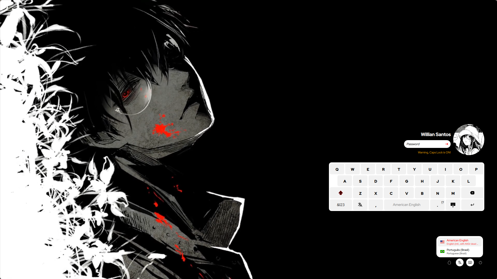

# 💫 Silent SDDM Theme & Hyprland Preset Switcher 💫

Customized **SilentSDDM** login theme with custom typography, animated video wallpapers, preset variants, and a dedicated **Rofi Quick Switcher** integrated with Hyprland.

---

## ✨ Features

- **Custom Typography (Hyprlock Match)**:
  - **Clock**: `Cracked Code` (Large bold aesthetic)
  - **Date**: `Oriental Chicken`
  - **Username**: `Oriental Chicken`
- **10 Curated Presets**:
  - 󰄛 **Silvia** (Animated/static monochrome aesthetic)
  - 🌸 **Rei** (Evangelion Rei animated theme)
  - ⚔️ **Ken** (Cyberpunk/anime style)
  - ☕ **Catppuccin** (Mocha, Macchiato, Frappé, Latte)
  - 🖥️ **Default** (Center, Left, Right layouts)
- **Instant Hyprland Rofi Switcher**:
  - Press **`SUPER + ALT + S`** to bring up the preset menu.
  - Zero password prompts (configured via safe sudoers rule).
  - Includes a one-click **"Test Current in Preview Window"** mode.

---

## 🖼️ Previews

### 󰄛 Silvia Preset


### 🌸 Rei Preset


### ⚔️ Ken Preset


---

## 🚀 Quick Install

To install or restore everything onto your system:

```bash
git clone https://github.com/Mr-Hasan-Hamid/sddm-theme.git
cd sddm-theme
./install.sh
```

---

## ⌨️ Hyprland Keybind

Add the following to your `~/.config/hypr/UserConfigs/user_keybinds.lua` or `UserKeybinds.conf`:

```ini
# Select SDDM Theme Preset (Silvia, Rei, Ken, Catppuccin, etc.)
bindd = SUPER ALT, S, Select SDDM Theme Preset, exec, $HOME/.config/hypr/scripts/RofiSddmPreset.sh
```

---

## 🧪 Preview Without Logging Out

Test any preset live in an isolated window:

```bash
sddm-greeter-qt6 --test-mode --theme /usr/share/sddm/themes/silent
```

---

## 📂 Repository Structure

```
sddm-theme/
├── theme/               # Full Silent SDDM theme files (QML, configs, icons, videos)
│   ├── configs/         # Silvia, Rei, Ken, Catppuccin configs (with custom fonts)
│   └── backgrounds/     # Video and image backgrounds
├── fonts/               # Cracked Code & Oriental Chicken font files
├── hyprland/
│   ├── scripts/         # RofiSddmPreset.sh & set-sddm-preset helper
│   ├── rofi/            # config-sddm.rasi (Single-column layout)
│   └── sudoers.d/       # Passwordless sudoers rule for preset switching
├── previews/            # High-res preset preview screenshots
├── install.sh           # Automated one-click installer
└── README.md
```
